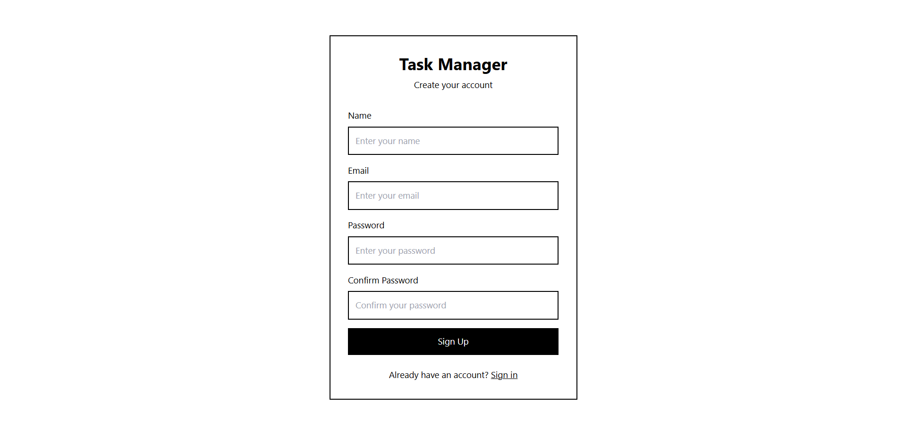
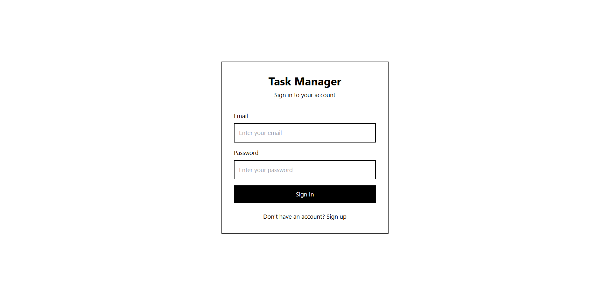
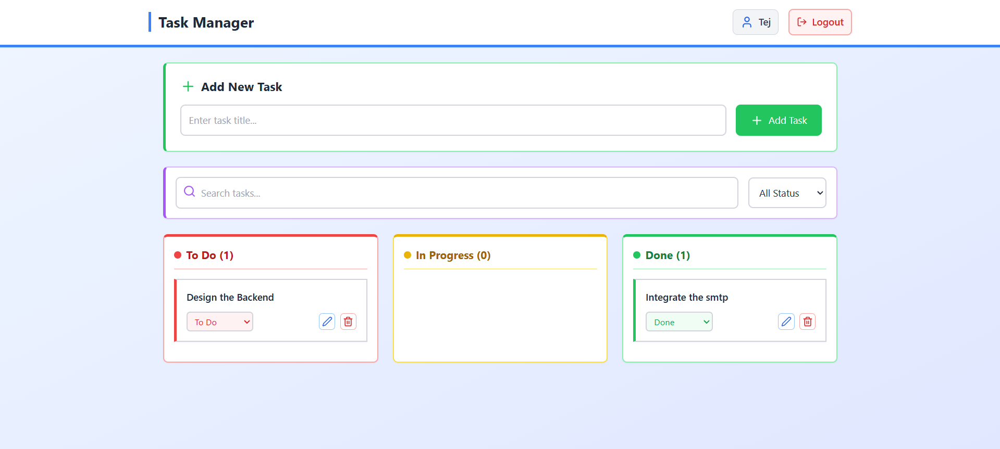

# 📝 Task Manager Web App

A full-stack task manager app built with **Node.js**, **Express**, **Sequelize**, **PostgreSQL**, and a modern **React.js** frontend. Users can register, log in, and manage tasks categorized by status: To Do, In Progress, and Done.

---

## 🔗 Project Demo

🎥 [Watch the Project Video](https://drive.google.com/file/d/1XShM93iILXojKg-33B51XkQhARwd1xJF/view?usp=sharing)

---

## 📸 Snaps

|  |  |  |

---

## 🚀 Features

- 🔐 User Authentication (JWT)
- 🧾 Task Management: Create, View, Update, Delete
- 📌 Tasks grouped by status
- 🔒 Secure password hashing using bcrypt
- 🌐 Full-stack app using React + Express + PostgreSQL
- 📦 Sequelize ORM

---

## 📁 Project Structure

```

.
├── backend/
│   ├── config/
│   ├── controllers/
│   ├── middleware/
│   ├── models/
│   ├── routes/
│   ├── .env
│   ├── index.js
│   └── package.json
│
├── frontend/
│   ├── public/
│   └── src/
│       ├── assets/
│       ├── components/
│       ├── pages/
│       └── App.js
│   └── package.json
│
├── README.md

````

---

## 🧑‍💻 Prerequisites

- Node.js installed
- PostgreSQL installed and running locally
- pgAdmin or any SQL client (optional)

---

## ⚙️ Environment Setup

### 🔧 Backend Setup

1. Create a local PostgreSQL database:
   - Example: `task_manager_db`

2. Inside the `backend/` folder, create a `.env` file:

```env
DB_NAME=task_manager_db
DB_USER=postgres
DB_PASS=your_postgres_admin_password
DB_HOST=localhost
PORT=3000
JWT_SECRET=your_jwt_secret_key
````

3. Install dependencies and run the backend:

```bash
cd backend
npm install
npm run dev  # or nodemon index.js
```

### 💻 Frontend Setup

1. Go to the `frontend/` folder:

```bash
cd frontend
npm install
npm run dev
```

> Make sure the frontend is set to hit the correct API base URL (usually `http://localhost:3000`).

---

## 🧪 API Endpoints

### 🔐 Auth Routes

* `POST /api/signup` – Register a new user
* `POST /api/login` – Login and receive JWT

### 📌 Task Routes (JWT Protected)

* `GET /api/tasks` – Get all user tasks
* `POST /api/tasks` – Create a task
* `PATCH /api/tasks/:id` – Update a task
* `DELETE /api/tasks/:id` – Delete a task

> 🔐 Include `Authorization: Bearer <token>` in headers.

---

## 🧼 Notes

* Sequelize auto-generates DB tables using `sync()`
* Passwords are hashed before storing in the database
* JWTs are used for route protection and session handling


This project is open-source and free to use.
Happy Coding...
